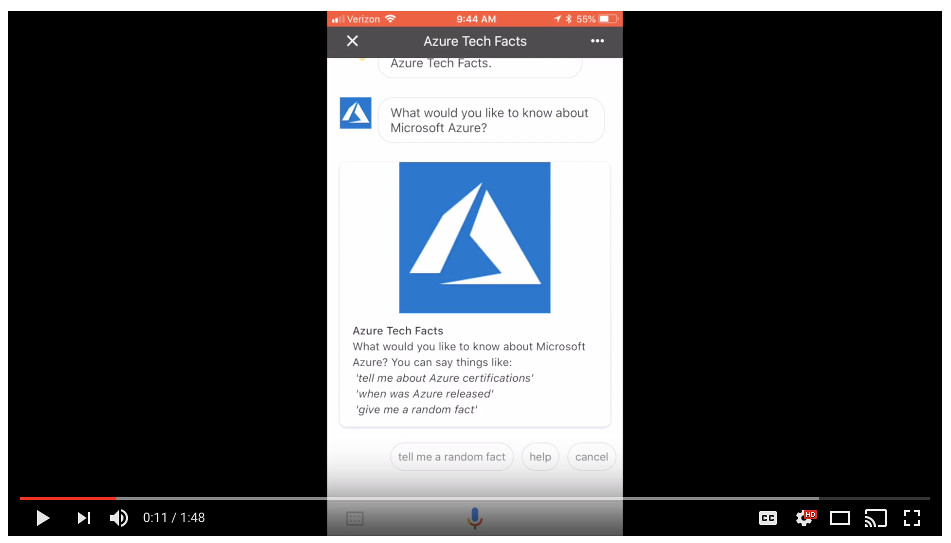

# Azure Tech Facts Action for Google Assistant
Project created for the post, [Building Serverless Actions for Google Assistant with Google Cloud Functions, Cloud Datastore, Cloud Storage](https://programmaticponderings.com/). In the post, we create an Action for Google Assistant using the ‘Actions on Google’ development platform, Google Cloud Platform’s serverless Cloud Functions, Cloud Datastore, and Cloud Storage, and the current LTS version of Node.js.

## Preview

Here is a brief [YouTube video preview](https://www.youtube.com/embed/DSONmyl_XdY) of the final Action for Google Assistant, we will explore in this post, running on an Apple iPhone 8.

## Architecture

The final architecture of the Action for Google Assistant will look as follows.

