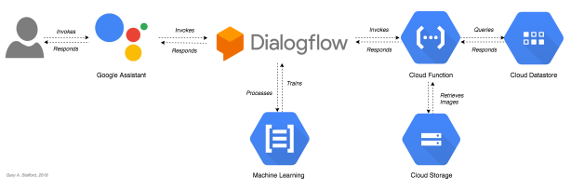

# Azure Tech Facts Action for Google Assistant
Project created for the post, [Building Serverless Actions for Google Assistant with Cloud Functions, Datastore, Storage, and Node.js](https://programmaticponderings.com/). In this post, we will create an Action for Google Assistant using the ‘Actions on Google’ development platform, Google Cloud Platform’s serverless Cloud Functions, Cloud Datastore, and Cloud Storage, and the current LTS version of Node.js. According to Google, Actions are pieces of software, designed to extend the functionality of the Google Assistant, Google’s virtual personal assistant, across a multitude of Google-enabled devices, including smartphones, cars, televisions, headphones, watches, and smart-speakers.

## Preview

Here is a brief preview of the final Action for Google Assistant, we will explore in this post, running on an Apple iPhone 8.

## Architecture

The final architecture of our Action for Google Assistant will look as follows.

